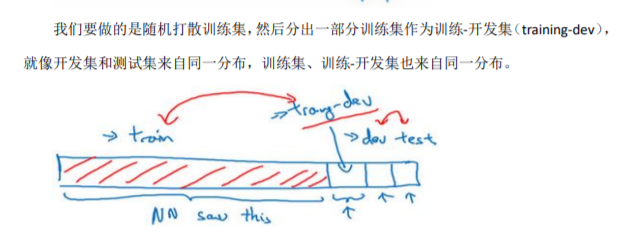
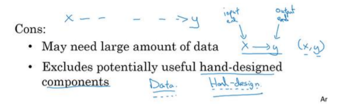
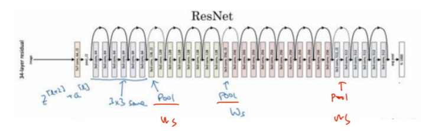

[toc]

# 第二门
## 第二周
##### 1. 正则化（L2范数、dropout、data augmentation、early stopping、算法（momentum、RMSprop、Adam））
   + 正则化的过程就是：过拟合---just right---线性未拟合。通过加入惩罚（$\lambda$足够大，$w$足够小，相当于网络变得简单【激活函数取一小段变成了线性函数】），总能够有一个中间过程是just right。
   + 正则化：L2范数、dropout、data augmentation、early stopping、算法（momentum、RMSprop、Adam）
##### 2. 优化 （optimization problem）
   + 归一化 （normalizing inputs）：加速训练。 1.零均值（$x-\mu,\mu=\frac{1}{m}\sum_1^mx^i$）；2.归一化方差($x/=\sigma^2,\sigma^2=\frac{1}{m}\sum_1^m(x^i)^2$)
##### 3. 初始化(梯度消失/梯度爆炸)
+ $t_z=w_1x_1+w_2x_2+...+w_nx_n,b=0$，暂时忽略$b$为了预防$z$值过大或过小，你可以看
到$n$越大，你希望$w_i$越小，因为$z$是$w_ix_i$的和，如果你把很多此类项相加，希望每项值更小，
最合理的方法就是设置$w_i=\frac{1}{n}$,$n$表示神经元的输入特征数量。
+ 实际上，你要做的就是设置某层权重矩阵𝑤[𝑙] = 𝑛𝑝. 𝑟𝑎𝑛𝑑𝑜𝑚. 𝑟𝑎𝑛𝑑𝑛(shape) ∗ np. sqrt($\frac{1}{n^{l-1}}$,$n^{[l-1]})$就是喂给第𝑙层神经单元的数量（即第𝑙 − 1层神经元数量）
+ tanh 函数来说,初始化$w^{l}=\sqrt{\frac{1}{n^{[l-1]}}}$
+ Relu 激活函数,初始化$w^{l}=\sqrt{\frac{2}{n^{[l-1]}}}$
##### 4. 梯度检测（双边误差更精确$O(\varepsilon^2)$检测是否正确进行了函数偏导）
### 优化算法
##### 1. **加速**-mini-batch 
（2的次方最好）64、128、1024必用
##### 2. **加速**-指数加权平均基础
   + $v_0=0;v_{t}=\beta v_t+(1-\beta)v_{t}$
   +  $\frac{1}{1-\beta}$代表平均多少天的均值
   + 指数加权平均（bias correction in exponentially weighted averages）的偏差修正 解决前期平均不准的问题：$\frac{v_t}{1-\beta^t}$
##### 3. **加速**-Monentum动量梯度下降-$\beta=0.9：v_{d_w}=\beta v_{d_w}+(1-\beta)v_{d_w};v_{d_b}=\beta v_{d_b}+(1-\beta)v_{d_b};W=W-\alpha v_{d_W};b=b-\alpha v_{d_b}$
##### 4. RMSprop
##### 5. Adam（Monentum+RMSprop）
$\beta_1=0.9;\beta_2=0.999;\epsilon=10^{-8}$
##### 6. 学习率衰减（learning rate decay）
   + $\alpha=\frac{1}{1+衰减率+epochNumber}\alpha_0$
   + $\alpha=0.95^{epochNumber}\alpha_0$
   + $\alpha=\frac{k}{\sqrt{epochNumber}}\alpha_0$或者 $\alpha=\frac{k}{\sqrt{t}}\alpha_0$
   + 离散下降的学习率
   + 手动
## 第三周
### 超参数tune
##### 1. 超参数的的重要排序
##### 2. 超参数范围选择不采用线性轴，用对数（例如：$r=-4*np.random.rand();a=10^r$）
##### 3. 调试实践（panda VS caviar）算力决定

### batch归一化（batch normalization）
1. $\mu=\frac{1}{m}\sum_iZ^{（i）}；\sigma^2=\frac{1}{m}\sum_i(Z^{（i）}-\mu)^2;z_{norm}^i=\frac{z^i-\mu}{\sqrt{\sigma^2+\epsilon}};z^-=\gamma z_{nomr}^i+\beta$保证均值和方差标准化，均值和方差由参数$\gamma、\beta$控制
2. 先归一，再激活
3. 将$Z$归一，其实$b$已经不起作用，所以可以删除
4. batch norm三个作用
   + 加速学习
   + 输入值更稳定，改变程度变小。当前层保持学习，改变时候，迫使后层适应程度减小，减弱前后层直接的联系，有助于加速
   + 轻微正则化。因为是在mini-batch，不是在整个数据集，均值和方差有噪声

### softmax回归
一般形式的回归，多分类，相加等于1

### TensorFlow [中文版tensorflow作业](https://blog.csdn.net/u013733326/article/details/79971488)
1. tensorflow中的常数，需要初始化变量，然后创建一个session来运行它
2. 占位符（placeholders），使用一个feed字典（feed_dict变量）来传入，占位符只是一个变量，我们会在运行会话时将数据分配给它。

---
# 第三门 结构化机器学习项目

## 第一周 机器学习策略1：什么参数控制什么

##### 1. 正交化（orthogonalization）
   + 定义：一个按钮控制一个功能（直角坐标x，y轴分别控制一个方向） 
##### 2. 单一数值指标非常重要
（有2个评价指标，可以求平均变成一个指标）
##### 3. 满足指标和优化指标
   + 满足指标：需要至少满足这个条件
   + 优化指标：你想尽可能的优化
##### 4. 训练/开发/测试集划分（Train/dev/test distributions）
   + 所有数据随机洗牌，放入开发集和测试集，
所以开发集和测试集都有来自八个地区的数据，并且开发集和测试集都来自同一分布
##### 5. 开发集和测试集的大小（Size of dev and test sets）
   + 旧的经验规则 70/30 不再适用了
   + 只有训练集和测试集也不是完全不合理的，一般不建议这么做
   + 比如有一百万个训练样本，98%作为训练集，1%开发集，1%测试集，用𝐷和𝑇缩写来表示开发集和测试集
##### 6. 什么时候该改变开发/测试集和指标？
   + 当前的指标和当前用来评估的数据和你真正关心必须做好的事情关系不大，那就应该更改你的指标或者你的开发测试集，让它们能更够好地反映你的算法需要处理好的数据
   + 做法可以是：增加权重，改变cost fuciton $J$
##### 7. 偏差bias和方差variance
   + 偏差bias：与真实值得差距
   + **高偏差解决办法**：增加数据、数据扩张、替换换模型
   + 方差variance：在不用数据集下的差异（测试集和开发集上不同得错误率）。
   + **高方差的解决**：正则化（drop out/L2正则化，增加健壮，减少过拟合）、更大训练集、Early Stopping（不建议）
##### 8. 可避免偏差（avoidable bias）
human error7.5%；training error：8% avoidable bias：0.5%
##### 9. human-level performance
    + 最低的hunman error 叫做bayers error
    + 超过不是最低的hunman error也具有一定的价值（一般医生看放射片）

## 第二周 机器学习策略2

#### 错误分析
##### 1. 人工进错误统计，列表找最应该优化的类型。
##### 2. 清除标注错误的数据（Cleaning up Incorrectly labeleddata）
   + 有时候修正这些错误是有价值的，有时候放着不管也可以，只要总数据集总足够大，实际错误率可能不会太高
   + 当测得的那么大一部分的错误都是开发集标记出错导致的，那似乎修正开发集里的错误标签似乎更有价值
   + 深度学习算法对随机误差很健壮，但对系统性的错误就没那么健壮了
##### 3. Just Do It
   快速搭建一个粗糙的系统，然后用它做偏差/方差分析，错误分析，确定下一步优先要做的方向。
---
#### 数据失配

##### 4. **数据失配的情况进行训练和测试**（Training and testing on different distributions）
   + 背景：可能数据太少，需要从其他类似的场景借用数据（cats from mobile **10K** / cats from web **200K**）
   + 如何分：1. **training data**：ats from web **200K**+cats from mobile **5K**；2.**dev data**: cats from mobile **2.5K**；3.**test data**: cats from mobile **2.5K**
##### 5. **数据分布不匹配时的偏差与方差的分析**（Bias and Variance with mismatched data distributions）
   + 策略：增加**traing-dev data** from traing data来分析Bias and Variance

##### 6. **处理数据失配问题**（Addressing data mismatch）
   + 如果存在数据不匹配问题，建议做**错误分析**，或者看看训练集和看看开发集，试图了解这两个数据分布到底有什么不同，然后是否有办法**收集更多看起来像开发集的数据**作训练
   + 到其中一种办法是人工数据合成，**但**要警惕有可能从所有可能性的空间只选了很小一部分去模拟数据，导致在小空间中过拟合。（1hour car noise合成/20 car from game）
---
#### 迁移和多任务学习
迁移学习使用频率高于多任务学习
##### 7. **迁移学习**（Transfer learning）
   + 迁移学习（Transfer learning）有时称为**预训练（pre-training）或叫微调（fine tuning）**
   + 最有用的场合是：如果你尝试优化任务𝐵的性能，这个任务数据相对较少，找一个相关但不同的任务，并从中学到很多低层次特征，也许能帮助网络
##### 8. **多任务学习**（Multi-task learning）
   + 与 softmax 回归不同，softmax 将单个标签分配给单个样本(一个y中只有一个1)；多任务中一个标签中有多个1（一个图像y=[1,1,0,0]代表有人，有车，没红绿灯，没停车标志）。
   + 训练一个神经网络（多任务学习）做四件事情会比训练四个完全独立的神经网络分别做四件事性能要**更好**
   + 多任务学习也可以处理图像只有部分物体被标记的情况。当有问号的时候，就在cost function求和时忽略那个项，这样只对有标签的值求和。
##### 9. **端到端的深度学习**（end-to-end learning）
   + 端到端深度学习就只需要把训练集拿过来，**直接学到了𝑥和𝑦之间的函数映射**，直接绕过了其中很多步骤。
   + **但**有的任务分成2个简单的任务处理比端到端容易的多，比如：判断手X光的年龄。
##### 10. **什么时候使用端到端的深度学习**？
   + (𝑥, 𝑦)数据集足够多的时候。
   + **Pros**：1.有足够多的(𝑥, 𝑦)数据，只让数据说话。2.所需手工设计的组件更少，所以这也许能够简化你的设计工作流程。
   

   + **Cons：**：1.它可能需要大量的数据。2.它排除了可能有用的手工设计组件，当数据比较少的时候，手工设计组件非常有用。
   

    ---

# 第四门（卷积神经网络Convolutional Neural Networks）

## 第一周 卷积神经网络（Foundations of Convolutional Neural Networks）

##### 1. 为什么卷积
   + 计算机视觉希望能处理大图。为此，需要进行卷积计算，提取特征，输入太大不好处理数据。
##### 2. 边缘检测示例（Edge detection example）
   + 过滤器（filter）/核（kernel）
   + H*W,边长通常是奇数。原因1：padding以后可以恢复到原来的尺寸；原因2：有中心像素
   + 垂直的、水平的边缘过滤器、Sobel 的过滤器、Scharr 过滤器
##### 3. Padding
   + 提出的原因：1.卷积操作图像就会缩小；2.在角落或者边缘区域的像素点在输出中采用较少，意味着你丢掉了图像边缘位置的许多信息
   + **Valid 卷积**:意味着不填充,如果个𝑛 × 𝑛的图像，用一个𝑓 × 𝑓的过滤器卷积，它将会给你一个(𝑛 − 𝑓 + 1) × (𝑛 − 𝑓 + 1)维的输出
   + **Same 卷积**:意味填充后，你的输出大小和输入大小是一样的。𝑛 + 2𝑝 − 𝑓 + 1 = n$\twoheadrightarrow p=\frac{f-1}{2}$
   + (𝑛 + **2𝑝** − 𝑓 + 1) × (𝑛 + **2𝑝** − 𝑓 + 1)
##### 4. 卷积步长（Strided convolutions）
   + ⌊ $\frac{𝑛 + 2𝑝 − 𝑓}{s}+1$⌋
##### 5. 单层卷积网络（One layer of a convolutional network）
   + 卷积层固定，卷积层的参数w，b个数都固定了，无论输入图片大小是多少。即：图片很大，参数却很少，这就是卷积神经网络的一个特征，叫作“**避免过拟合**”。
   + **H和W**在一段时间内保持一致，然后**随着网络深度的加深而逐渐减小**，而**通道数量(filter)在增加**
   + 虽然仅用卷积层也可构建出很好的神经网络，但依然会添加**池化层和全连接层**
##### 6. **池化层**（Pooling layers）
   + 作用：常使用池化层来缩减模型的大小，提高计算速度，同时提高所提取特征的鲁棒性
   + 最大池化（max pooling）
   + 平均池化，它不太常用
   + 池化的超级参数包括过滤器大小𝑓和步幅𝑠，常用的参数值为**𝑓** = 2，**𝑠** = 2 **相当于**尺寸缩小一倍（28$\times$28使用𝑓 = 2，𝑠 = 2编程14$\times$14）
   + $n_H\times n_W$ Pooling ⌊ $\frac{n_H-f}{s}+1\times\frac{n_W-f}{s}+1$⌋
   + 池化过程中没有需要学习的参数（静态属性）
##### 7. 卷 积 神 经 网 络 示 例 （ Convolutional neural networkexample）
   + 尽量不要自己设置超参数，而是查看文献中别人采用了哪些超参数
   +   

##### 8. 卷积网络**参数少**有两个原因（更小的训练集来训练它，从而预防
过度拟合）
   + 1.**参数共享**。每个特征检测器以及输出都可以在输入图片的不同区域中使用同样的参数，以便提取垂直边缘或其它特征。它不仅适用于边缘特征这样的低阶特征，同样适用于高阶特征，例如提取脸上的眼睛，猫或者其他特征对象
   + 2.**稀疏连接**。解释下。这个 0 是通过 3×3 的卷积计算得到的，它只依赖于这个 3×3 的输入的单元格，右边这个输出单元（元素 0）仅与 36 个输入特征中 9 个相连接。而且其它像素值都不会对输出产生任影响，这就是稀疏连接的概念。
   +   

## 第二周
#### 学习案例Case studies
##### 1.实例探究的目的
在计算机视觉任务中表现良好的神经网络框架往往也适用于其它任务
##### 2.经典网络（Classic networks）AlexNet\VGG-16\LeNet
论文阅读顺序：AlexNet 的论文开始，然后就是 VGG 的论文，最后是 LeNet 的论文。
+ **LeNet-5（1998）**
  

  1. LeNet-5 是针对**灰度图片**训练，所以图片的大小只有 32×32×1
  2. 那个年代，人们更喜欢使用**平均池化**
  3. 只有约 **6 万个参数**。（现在：经常看到含有一千万到一亿个参数的神经网络）
  4. 网络越来越深，**高度和宽度在缩小，通道数量一直在增加**
  5. 在当时，计算机的运行速度非常慢，为减少计算量和参数，经典的 LeNet-5 网络使用了非常**复杂的计算方式，现在一般都不用了**。
  6. 建议：我建议精读第二段（网络结构），泛读第三段（实验结果）
+ **AlexNet（2012）**
  

  1. **227×227×3尺寸**输入更好一些。原文中使用的图像是224×224×3。
  2. 比LeNet更好的原因：AlexNet 包含约 **6000 万个参数**，LeNet只有6万。其次AlexNet使用了 **ReLu 激活函数**。
  3. **弃用**部分：当时GPU的处理速度还比较慢，所以 AlexNet 采用了非常复杂的方法在两个 GPU 上进行训练。AlexNet 结构还有另一种类型的层，叫作“局部响应归一化层”（LocalResponse Normalization），即 LRN 层，发现作用不大，现在不用了。
+ **VGGNet-16（2015）**
  

  1. 16 个卷积层和全连接层。
  2. 1.38 亿个参数
  3. 池化层缩小图像的高度和宽度，卷积层的过滤器数量变化存在一定的规律：**翻倍**
  4. **缺点**是需要训练的特征数量非常巨大

##### 3.残差网络(2015 ResNets)( Residual Networks)
深度神经网络存在梯度消失和梯度爆炸问题。**跳跃连接（Skip connection）/(short cut)捷径**，构建能够训练深度网络

+ **解决的问题**：随着网络深度的加深，训练错误会先减少，然后增多
+ 确实**有助于解决梯度消失和梯度爆炸问题**

+ **网络性能不受影响**，很多时候甚至可以提高效率，或者说至少不会降低网络的效率，也只把$a^{[l]}$的值赋值给$a^{[l+1]}$
+ 因为要跳跃，然后加前面的$a$,所以ResNets 使用了**许多same卷积**。
+ 如果**输入和输出有不同维度，再增加一个矩阵**$W_s$(256×128),如：如输入的维度是128，$a^{[l+2]}$维度是256，所以$W_sa^{[l]}$（256）
+ **结构**：**卷积层-卷积层-卷积层-池化层-卷积层-卷积层-卷积层-池化层**……依此重复。直到最后，有一个通过**softmax**进行预测的全连接层。

##### 4.1×1 卷积（Network in Network /1×1 convolutions）
1×1 卷积的简单操作来压缩或保持输入层中的通道数量，甚至是增加通道数量

##### 5.谷歌 Inception网络(2014)（Inception network）
+ **Inception模块的作用**：代替你来决定定过滤器的大小究竟是 1×1，3×3 还是 5×5，或者要不要添加池化层。

+ **合理构建瓶颈层**：显著缩小表示层规模，又不会降低网络性能，从而节省了计算

+ **Inception network**
  

  
  1. **细节1：** 分支（编号 2）所做的就是通过隐藏层（编号 3）来做出预测，所以这其实是一个 softmax 输出（编号 2），这（编号 1）也是。这是另一条分支（编号 4），它也包含了一个隐藏层，通过一些全连接层，然后有一个 softmax 来预测，输出结果的标签。
  2. **细节2：** 这是另一个 Inception 模块（编号 2），这也是一个Inception 模块（编号 3）。这里有一些额外的最大池化层（编号 6）来修改高和宽的维度。这是另外一个 Inception 模块（编号 4），这是另外一个最大池化层（编号 7），它改变了高和宽。而这里又是另一个 Inception 模块（编号 5）。
  3. Inception网络是由Google公司的作者所研发的，它被叫做**GoogleLeNet**，这个名字是为了**向 LeNet 网络致敬**
  4. Inception 名字来缘：**盗梦空间**Inception中的梗meme（“我们需要走的更深”（**We need to go deeper**）

---
### 实战建议
##### 6.使用github
##### 7.迁移学习（Transfer Learning）
+ 把权重下载下来。1.把所有的层看作是冻结的，去掉这个 Softmax 层，创建你自己的 Softmax 单元（trainableParameter=0/freeze=1）
+ 冻结更少的层,取后面几层的权重，用作初始化，然后从这里开始梯度下降
+ 极端情况下，你可以用下载的权重只作为初始化，用它们来代替随机初始化，接着你可以用梯度下降训练，更新网络所有层的所有权重
##### 8.数据增强（Data augmentation）
+ **垂直镜像对称**
+ **随机裁剪**(不完美的数据增强的方法，随机裁剪的那一部分可能看起来不像猫。但实的，大部分的真实图片。)
+ **彩色转换**（color shifting）：R、G 和 B 三个通道上加上不同的失真值，更具**鲁棒性**
+ CPU 实现任意失真变形和traing可以**并行实现**
+ 旋转，剪切，扭曲。这些方法并没有坏处，太复杂了所以使用的很少
##### 9.计算机视觉现状（The state of computer vision）
+ 机器学习问题是介于少量数据和大量数据范围之间
+ **两种知识来源**：一个来源是**被标记的数据**，就像(𝑥，𝑦)应用在监督学习。第二个知识来源是**手工工程**
+ 有少量的数据时，迁移学习
+ 基准测试中小技巧：1.一个是**集成**，可以独立训练**几个**神经网络，并平均它们的输出。2.**Multi-crop at test time（10-crop 的技术）**，**一个**神经网络
   

