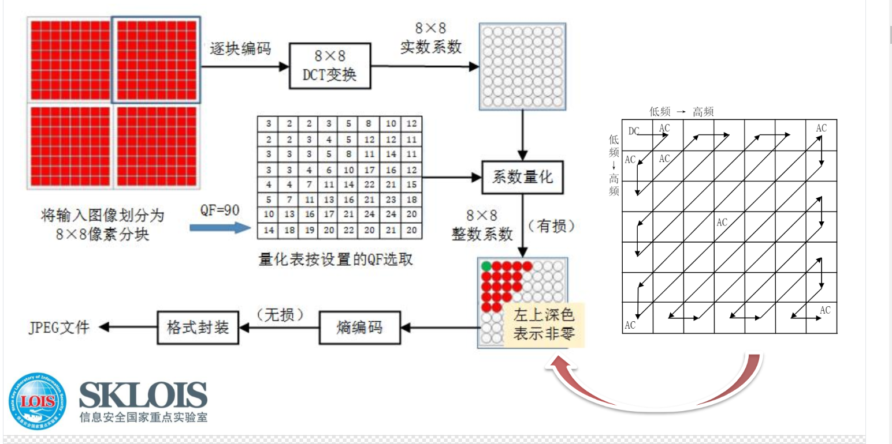
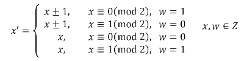
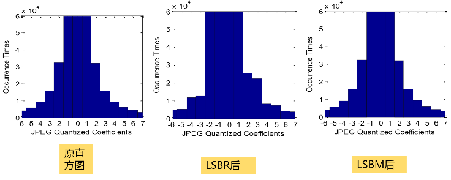

- [第2章 图像编码与基本嵌入方法](#第2章-图像编码与基本嵌入方法)
  - [2.1 RGB、YUV和YCbCr空域图像编码格式](#21-rgbyuv和ycsubbsubcsubrsub空域图像编码格式)
  - [2.2 JPEG 变换域图像编码流程](#22-jpeg-变换域图像编码流程)
  - [2.3 二元嵌入 LSBR（least significant bit replacement）与三元嵌入LSBM（LSB matching）](#23-二元嵌入-lsbrleast-significant-bit-replacement与三元嵌入lsbmlsb-matching)
    - [二元嵌入LSBR](#二元嵌入lsbr)
    - [三元嵌入LSBM](#三元嵌入lsbm)
  - [2.4 调色板隐写](#24-调色板隐写)
    - [基于亮度排序的调色板](#基于亮度排序的调色板)
    - [基于距离排序的最佳奇偶分配（optimum parity assignment，OPA）的调色板隐写](#基于距离排序的最佳奇偶分配optimum-parity-assignmentopa的调色板隐写)
  - [2.5量化调制与格（略）](#25量化调制与格略)
- [第3章 隐写分布特性的保持](#第3章-隐写分布特性的保持)
  - [3.1 分布特性的识别（$\chi$2统计量：识别LSBR)](#31-分布特性的识别chisup2sup统计量识别lsbr)
  - [3.2 基于预留补偿区的分布恢复的方法（OutGuess隐写方案/软件）](#32-基于预留补偿区的分布恢复的方法outguess隐写方案软件)
  - [3.3基于统计模型的方法（Model-based，MB）](#33基于统计模型的方法model-basedmb)
  - [3.4基于调整修改方式的隐写(F3/F4/F5)](#34基于调整修改方式的隐写f3f4f5)
    - [3.4.1 F3隐写（改进值对保持对称、修改=绝对值减1、重传更多0、制造了更多的偶数）](#341-f3隐写改进值对保持对称修改绝对值减1重传更多0制造了更多的偶数)
    - [3.4.2 F4隐写（改进F3、负偶数/正奇数代表1，负奇数/正偶数代表0、修改=绝对值减1、解决了偶数变多问题，但仍存在向0收缩）](#342-f4隐写改进f3负偶数正奇数代表1负奇数正偶数代表0修改绝对值减1解决了偶数变多问题但仍存在向0收缩)
    - [3.4.3 F5隐写（矩阵编码）](#343-f5隐写矩阵编码)
    - [自适应思想的MMEx](#自适应思想的mmex)
- [第5章专用隐写分析](#第5章专用隐写分析)
  - [5.1专用隐写分析VS通用隐写分析](#51专用隐写分析vs通用隐写分析)
  - [5.2 RS分析（针对LSBR）](#52-rs分析针对lsbr)
- [第6章湿纸编码](#第6章湿纸编码)
  - [6.1 基本概念](#61-基本概念)
  - [6.2 典型“湿点”与“干点”（置乱域+二层可嵌入）](#62-典型湿点与干点置乱域二层可嵌入)
  - [6.3湿纸编码隐写](#63湿纸编码隐写)
    - [6.3.1 量化扰动（Perturbed Quantization，PQ）](#631-量化扰动perturbed-quantizationpq)
    - [6.3.2 抗收缩JPEG隐写](#632-抗收缩jpeg隐写)
    - [6.3.3 ±1双层嵌入](#633-1双层嵌入)
- [第7章 基于±1的分组隐写编码](#第7章-基于1的分组隐写编码)
  - [7.1 一个特例LSBM-R(LSB matching revisited)](#71-一个特例lsbm-rlsb-matching-revisited)
  - [7.2基于和差覆盖集的GLSBM（Generalization LSB Matching）](#72基于和差覆盖集的glsbmgeneralization-lsb-matching)

---
## 第2章 图像编码与基本嵌入方法

---
### 2.1 RGB、YUV和YCbCr空域图像编码格式

**RGB(模型)**：RGB888是依据人眼识别的颜色定义出的空间。它的细节难以进行数字化的调整。

RGB的取值范围为：[0,255]、[0,255]、[0,255]

**YUV(模型)**: 
YUV的取值范围为：[0,255]、[负整数,正整数]、[负整数,正整数]
1. 相对于RGB，将亮度和色度分离开，从而适合于图像处理领域
2. 相对于RGB，兼容彩色电视与黑白电视问题，只有Y则是灰度图像。

**Y**表示**亮度(Luminance component/Luma)** Y = 0.299R + 0.587G + 0.114B，只有Y信号=**灰度图像**

**U、V**用来表示**色度(Chrominace/chroma)**，**U、V**是构成彩色的两个分量。

此时，我们设 U = 0.492(B - Y)，V=0.877(R-Y) 则可以求得：

U = - 0.147R- 0.289G + 0.436B　　V = 0.615R - 0.515G - 0.100B
即：

**YCbCr**: 为了统一YUV模型的取值范围为[0,255]

**总结2.1**：YUV色彩模型来源于RGB模型，YCbCr模型来源于YUV模型，还未涉及压缩，压缩是JPEG通过YUV411或YUV422**采样**实现。YUV为分离亮度和色度，及实现黑白彩色电视兼容提出，YCbCr为改变YUV取值范围为[0,255]

---
### 2.2 JPEG 变换域图像编码流程
**有损压缩**

因人眼对亮度变换的敏感度要比对色彩变换的敏感度高出很多，所以，可以认为Y分量要比Cb和Cr分量重要的多。

通常采用两种采样方式：YUV411和YUV422，它们所代表的意义是Y,Cb和Cr三个分量的数据取样比例一般是4：1：1或者4：2：2（在2x2的单元中，本应分别有4个Y，4个U，4个V值，用**12**个字节存储。经4:1:1采样处理后，每个单元中的值分别有4个Y、1个U、1个V，只用**6**个字节。

1. **YCbCr格式输入**。若输入不是YCbCr格式，则转换成YCbCr;
2. **图像切分成8×8和采样**。若H和W不是8的倍数，则需要扩充到8的倍数（Y通常是嵌入域），并对Cb和Cr进行YUV411或YUV422采样；（例如16×16的块，包含4个Y分块和1个Cb和1个Cr）
3. **DCT II变换**。将输入分块均-128,范围 [0,255] 到 [-128,127] 以满足DCT输入条件（偶函数）；每个8×8分块都通过DCT II变换得到8×8的浮点数DCT系数矩阵 Mdct（最左上角的点为直流系数DC，其余为交流系数AC）。
4. **量化**=Mdct / Qi，然后取整。通过质量因子QF(如80)选取8×8的量化表 Qi，QF的取值范围为（70-100）（新的量化后矩阵就会出现很多0）
5. **无损压缩**。64个DCT矩阵排成一维序列，**DC部分**采用差分编码（DPCM）只记录相邻块的DC系数差，**AC系数部分**采用游程编码RLEC，最后将DPCM和RLEC进行熵编码，也就是哈夫曼编码(Huffman),最后加上头文件。

---
### 2.3 二元嵌入 LSBR（least significant bit replacement）与三元嵌入LSBM（LSB matching）

#### 二元嵌入LSBR
* **应用**：**Jsteg**隐写软件，在JPEG量化DCT系数采用LSBR
* **原理**：**奇小偶大**，替换最小bit位，最小位若是0（**偶数**）变1（**+1**），最小位若是1（**奇数**）变0（**-1**）
* **缺陷**：**值对**现象出现，使得相邻像素的值接近，如：2i与2i+1趋于相等，如图：

* **优势**：在JPEG量化系数-1、0、1不适用，通常最小值对是2与3、是-2与-3，**奇小偶大**可以使得1与2、-1与-2是最小值对，从分利用了分布较密的1与-1。
#### 三元嵌入LSBM

* **提出原因**：解决LSBR值对问题
* **原理**：

如：2=(010)2，**if** s=0，(010)2不变；**if** s=1，(010)2+1=(011)2=3 or (010)2-1=(001)2=1
* **性能分析**：

**总结2.3**：三元嵌入LSBM解决二元嵌入LSBR值对问题，提高安全性。

---
### 2.4 调色板隐写

#### 基于亮度排序的调色板
* **应用**：**EzStego**亮度排序调色板，再对索引值进行LSBR
* **隐写原理**： 亮度序号奇偶性就是颜色的奇偶性，奇偶性代表了隐写值
* **缺陷**：亮度排序**不**准确，EzStego软件隐写后图片色彩有跳跃性

#### 基于距离排序的最佳奇偶分配（optimum parity assignment，OPA）的调色板隐写
* **OPA的作用**：使得$c_i$与最近距离$s_i$的奇偶性必定不同
* **颜色距离的定义**： $d[i,j]=d_{RGB} (c_i,c_j)=\sqrt{(r_i+r_j)^2+(g_i+g_j)^2+(b_i+b_j)^2}$
* **嵌入原理**：使用颜色三个分量和的奇偶性$P(c_i)=(r_i+g_i+b_i)mod 2$表示隐写消息的比特
* **OPA隐写原理** 
设调色颜色共有N个,令$P$={空},$c_i$奇偶性用$P(c_i)$（**0/1**分别代表二元奇偶性）表示。**（注意，$P$和$P(c_i)$不是一个东西，$P(c_i)$中是Parity）**
   1. 计算并排序全部$d[i,j]$，得到**非递减序列**(因为有相等距离存在)$D=\cdots d[u,v]\leq d[k,l]$，Notes：计算**N!**次；
   2. 得到**唯一序列D**。例如，对相等距离的d，按照颜色索引值大小进行排序。**Notes**：**递减**序列
   3. 因为是**非递减唯一序列**，从小的距离$d[i,j]$开始分配奇偶
      * $if c_i \notin P$集合且$c_j \notin P$集合，分配相反的奇偶性给$c_i$与$c_j$,$P集合=P\cup${$c_i$}$\cup${$c_j$}
      * $if c_i \notin P$集合且$c_j \in P$集合，则将$P(c_i)=1-P(c_j)$**（奇偶性相反，$P(c)$代表的是奇偶性！）**，$P集合=P\cup${$c_i$}
      * $if c_i \in P$集合且$c_j \notin P$集合，则将$P(c_j)=1-P(c_i)$，$P集合=P\cup${$c_j$}
   (因为从小距离开始，所以最短距离先分配)

**总结2.4：**距离排序相比于亮度排序更加准确，最佳奇偶分配OPA使得颜色$c_i$与最近距离的颜色奇偶性一定不同。

### 2.5量化调制与格（略）

---

## 第3章 隐写分布特性的保持

**统计特征保持**：隐写中**尽可能的维持**载体的**统计分布**，并非要求完全一致。（一般指一阶载体分布的保持，尚未出现一阶以上的载体分布保持）

### 3.1 分布特性的识别（$\chi$2统计量：识别LSBR)

**回顾第二章-LSBR特性**：奇值只减，偶值只加

*例*：$h(2i)$表示采样点$2i$的直方图值，$h^x(2i)$表示为隐写后的值。不失一般性，**因**$h(2i)>h^x(2i)$，**所以**更多$h(2i)$变成了$2i+1$。
$\Rightarrow|h(2i)-h(2i+1)|\geq|h^x(2i+1)-h^x(2i)|$  *(造成对值分布更接近的原因)*

**提示：**
$|h(2i)+h(2i+1)|=|h^x(2i+1)+h^x(2i)|$*(值对**不外流**)*。
如 011-010互相改变，但不失一般性，原始的010的数量比原始的011数量多，所以，更多010变成了011，较少的011变成了010，造成了值对
$\Rightarrow$(教材P20)总有一个数量的增加多余减少

---
**$\chi^2$统计量**:服从$N(0,1)$高斯（正态）分布变量**平方和**的分币。

**记：**
+ $$y^x(i)=\frac {(h^x(2i)+h^x(2i+1))}{2};$$
其中，$y^x(i)$是**固定值**;
+ $$y(i)=h^x(2i)$$ 
其中，$y(i)$是**偶数修改后的值**。

**因为**在JPEG系数中0和1经常不用，**所以**$i$从1开始，有$i=1,2,...,d-1$。

**Notes：**
1. $y^x(i)=y^*(i)$
2. $h^x(i)=h^*(i)$
3. $f(t)$为统计特征$t-\chi^2(d-1)$；**因为**在JPEG系数中0和1经常不用，**所以**$i$从1开始，有$i=1,2,...,d-1$。

---

**$\chi^2$分布特性分析**：$t$越小越可能存在隐写（因LSBR隐写算法会造成值对），设计阈值$\gamma$假设检验：

**漏检率**：$P_{\rm MD}(\gamma)=\int_\gamma^\infty f(t){\rm d}t$

**误检率**：$P_{\rm FA}(\gamma)=\int_0^\gamma f(t){\rm d}t$
$${正确率=1-\frac {漏检率+误检率}{2}}$$
由于含密载体$t$值非常小，因此，在实际中可以简单地用以下**统计量**完成检测:
$$\color{red}{p=\int_T^\infty f(t){\rm d}t=1-\int_0^T f(t){\rm d}t}$$

  其中，$T$表示根据输入图像计算得到的$t$值（$t$服从$\chi^2分布$），若$p$接近1，则存在隐写。

$\color{red}{优点：}$对于**连续LSBR嵌入**的隐写非常有效，甚至可以**估计嵌入长度**

$\color{red}{缺点：}$对**不连续、非满负载LSBR**的分析性能**下降**很快。因此**Provos[3.1]**提出了“**滑动窗口$\chi^2$分析方法**”。

滑动窗口$\chi^2$分析方法：**随机选择**LSBR的**局部**进行$\chi^2$分析；$\chi^2$分析对局部密集嵌入区域仍然有效，使得对隐密载体的总体检测情况仍然呈现一定的异常。
[3.1]Provos N. Defending Against Statistical Steganalysis[C]//Usenix security symposium. 2001, 10: 323-336.

---

### 3.2 基于预留补偿区的分布恢复的方法（OutGuess隐写方案/软件）
**预留补偿区**：指不嵌入秘密信息的区域，此区域用于进行相应的补偿处理，从而恢复载体的分布特性。

**Outguess：** 是Provos设计的**JPEG图像隐写软件**，采用一阶统计特征保持方法，即LSBR嵌入后，调整**预留补偿区的LSB**(未嵌入秘密信息的区域)修复直方图。
+ 采用流密码RC4加密（异或）秘密信息，密钥双方已共享。
  (见3.1 StreamCipherRC4)

**OutGuess统计保持算法策略**
+ 针对一对邻值上的（总体）分布，算法不急着立即这么做修改邻值，它对各个值上修改次数进行记录，允许暂时在一定的次数(𝛽)内不修改，$\color{red}{目的是希望等待值对上修改需求的相互抵消}$；
+ 只有需要修改的次数超过设置的次数(𝛽)，才调用 𝑒𝑥𝑐ℎ𝐷𝐶𝑇函数基于前面区域进行修正；
+  但在修正失败的情况下，继续增加记录的修改次数；逐个系数
考察完毕后，最后对记录的需要修改次数再进行一轮处理$\color{red}{不确保实现完全的修正}$

$\color{red}{OutGuess缺点：}$预留补偿区域的分布恢复方法显著降低了嵌入效率，实际也更严重影响了二阶及以上阶的统计特性

源码地址（C++）：https://github.com/crorvick/outguess

---

### 3.3基于统计模型的方法（Model-based，MB）

**因为**基于预留补偿区域的分布恢复方法显著降低了嵌入效率，实际也更严重影响了二阶及以上阶的统计特性。

**所以**P.Salle提出了**基于模型（Model-based，MB）的隐写**，不会引起嵌入效率下降的问题，甚至还有提高。

**基本思想：**
+ 将载体信号建模为由两部分组成的随机变量**X=(Xdet, Xindet)**，其中Xdet和Xindet分别表示**确定的和非确定的部分**。隐写时，将只更改Xindet，从而保持它的分布不变，而且将确保隐密对象的非确定部分服从一定的分布模型。(在LSBR中，Xindet表示最后一个比特，非0即1)
+ 计算确定部分Xdet的概率分别，并根据假设的模型，计算非确定部分Xindet相对确定部分Xdet的条件概率。
+ 用熵解码器把均匀分布的秘密信息比特解码成服从上述条件概率分布的数据。
+ 用得到的数据替换Xindet，得到隐密对象。

基于MB模型隐写的嵌入过程如图:

提取过程如图所示：

Sallee将MB隐写框架应用于JPEG图像，提出了基于广义Cauchy模型的JPEG隐写，简称为Cauchy MB隐写。由于该算法是基于MB隐写框架设计的第一个隐写算法，也被称为MB1隐写。

与常用的高斯分布、广义拉普拉斯分布等相比，柯西分布能够更好地拟合AC系数直方图。尤其在柯西分布的尾部，能够对直方图进行非常好的拟合。
柯西分布具有封闭形式的概率分布函数，这使得能够方便地计算每个直方图方条的概率。

（2，2）的AC系数直方图及其拟合的柯西曲线如图所示：

为了保持分组内各系数值所占的比例与用柯西分布拟合所得到的一致，MB1隐写将**秘密信息、每个系数值在分组内的相对位置及其条件概率传至熵解码器**，以解码得到隐写后的每个系数值在分组内的相对位置，从而得到隐密系数。
为了避免只改变图像的一部分而引起的与未含秘密信息部分的视觉差异，用于隐写信息的系数顺序将随机确定。

嵌入过程：
1) 给定JPEG格式的载体图像，加密后的信息。得到载体图像AC系数值的低精度直方图（系数值分组长度大于1）作为Xdet；
2) 采用最大似然拟合每个直方图的模型参数和；
3) 由系数值在各自分组内的偏移组成Xindet, 利用模型的条件概率密度函数计算每个系数的值所在的分组内所有可能的偏移相对其分组的条件概率；
4) 选取一个伪随机置乱，以确定系数顺序；
5) 以4)中确定的顺序将秘密信息、系数偏移、3)中计算得到的条件概率传至一个非自适应算术解码器。解码得到含秘密信息的偏移；
6) 根据系数值所在的分组和解码得到的系数值在分组内的偏移，得到隐写后的系数。
提取过程：
1)-4)与嵌入过程相同。
5) 以4)中确定的顺序将系数偏移、3)中计算得到的偏移概率传至非自适应算术编码器。编码得到秘密信息。

之后，考虑到MB1隐写将增大图像8×8块间的不连续性，即分块效应，Phil Sallee只在至多一半的非0系数上进行MB1隐写，然后对剩下的非0系数值进行调整，以减小分块效应，从而提出MB2隐写。

源码地址（matlab）：http://www.pudn.com/Download/item/id/1748692.html

---
### 3.4基于调整修改方式的隐写(F3/F4/F5)
#### 3.4.1 F3隐写（改进值对保持对称、修改=绝对值减1、重传更多0、制造了更多的偶数）
论文（2-F5-A steganographic algorithm High capacity despite better steganalysis(2001,IH,CR1118)
为了克服Jsteg隐写不能抵抗卡方分析的缺陷，F3隐写对JSteg隐写进行了改进，具体嵌入策略如下：
**嵌入过程：**
1. 信息嵌入时，若JPEG系数的LSB与要嵌入的秘密信息比特**相同**，**则不做改动**；**否则**，JPEG系数的**绝对值减1**；
2. 秘密信息嵌入在非0的JPEG系数上，为0的系数不嵌入信息。当在绝对值为1的系数上嵌入比特0时，会产生新的0系数，则此次嵌入无效，在下一个系数中重新嵌入。

**提取过程：**
对F3隐写后的秘密信息提取时，只要将**非0的JPEG系数的LSB提取**。

嵌入方式如图所示：

嵌入前和隐写后对比图：

**F3隐写的特点：**
1. 保持了JPEG系数统计分布关于0的对称性；
2. 嵌入时，当绝对值为1的JPEG系数修改为0时，由于提取算法不能分辨这个0是消息嵌入产生的0和未使用的0，所以**必须重传这一消息0**（绝对值为1的系数已经被修改，因为提取算法不提取0系数的LSB，所以还要继续嵌入这个消息0到其他系数），嵌入算法要往后**寻找一个非0偶数，或寻找一个奇数并将其绝对值减1修改成非0偶数**（缺陷：重传了更多的0，制造了更多的偶数）；
3. 嵌入了更多的零，这一异常可以被利用于隐写分析;
4. 重传导致DCT系数中偶数明显增多(除0外)。原始图像一般来说DCT系数中奇数总数多于偶数总数(不包括零)，这样很容易区分开原始图像和载密图像。

源码地址为（python）：https://github.com/uuuup/F3_stegano
（matlab）http://www.pudn.com/Download/item/id/3190169.html

---

#### 3.4.2 F4隐写（改进F3、负偶数/正奇数代表1，负奇数/正偶数代表0、修改=绝对值减1、解决了偶数变多问题，但仍存在向0收缩）
论文（2-F5-A steganographic algorithm High capacity despite better steganalysis(2001,IH,CR1118)
F4隐写对F3隐写进行了改进，具体嵌入过程如下：
1. 负偶数、正奇数代表嵌入了1；用负奇数、正偶数代表嵌入0
2. 通过减小绝对值方法进行修改产生系数0，则视为无效嵌入，在下一个系数中重新嵌入0

F4嵌入方式:

F4嵌入前and隐写后：

F4隐写嵌入的JAVA源码:

**F4隐写的特点：**
1.正偶数、负奇数代表0；负偶数、正奇数代表1；
2.若当前系数代表的消息位与待嵌入的消息位不一致，该系数的绝对值减小1;
3.系数绝对值减小1后若为0（**两种情况：1嵌入0，-1嵌入1**），则继续往下嵌入当前比特;
4.重传的消息比特0和1的个数近似相等。（仍然存在使含密载体分布函数向0收缩的现象、但解决了偶数比奇数多的问题）
5.F4隐写后，图像的DCT系数直方图特性得到了保持。

**F4分布函数的单调性和梯度递减性证明：**

$P$为分布概率，$X$和$Y$分布代表嵌入前后的JPEG系数

密文可认为是伪随机分布，例$X=1$时有一半可能承载消息比特1，有：
$$P(Y=1)=\frac{1}{2}P(X=1)+\frac{1}{2}P(X=2) $$
$$P(Y=2)=\frac{1}{2}P(X=2)+\frac{1}{2}P(X=3)$$
$$P(Y=3)=\frac{1}{2}P(X=3)+\frac{1}{2}P(X=4)$$
因此可以得到：
$$P(Y=1)-P(Y=2)=\frac{1}{2}P(X=1)-\frac{1}{2}P(X=3)>0 $$
$$P(Y=2)-P(Y=3)=\frac{1}{2}P(X=2)-\frac{1}{2}P(X=4)>0$$
因此可以得到：
$$P(Y=1)>P(Y=2)>P(Y=3)\color{red}{{\rm F}4 单调性}$$
$$P(Y=1)-P(Y=2)>P(Y=2)-P(Y=3)\color{red}{\rm F}4{梯度递减性}$$

---

#### 3.4.3 F5隐写（矩阵编码）
（见3.3 Linear block error correcting code/3.4 74HammingCode） 

论文（2-F5-A steganographic algorithm High capacity despite better steganalysis(2001,IH,CR1118)

F4隐写使直方图特性得到了保持，但F4隐写是顺序嵌入的，这就使得LSB的修改集中在图像的某一部分，可能导致图像质量的不均匀。所以F5隐写在F4隐写基础上，引入混洗和矩阵编码技术。混洗使得隐密图像的质量比较均衡。矩阵编码将减少嵌入对系数的更改，以提高嵌入效率。

**嵌入过程：**
1. 获取嵌入域。获取载体图像，进行JPEG压缩，得到**量化**后的DCT系数；
2. 置乱。对第一步中得到的**AC系数**进行**置乱**，**置乱的方法作为密钥（伪随机发生器）**；
3. 对可用的AC系数计数，并根据欲嵌入的**秘密信息长度计算**得到嵌入信息所使用的**三元组**$(1，n=2^k-1, k)$;
4. 取出置乱后的非0的AC系数及欲嵌入的比特信息，采用**矩阵编码进行嵌入**（取$\color{red}{n}$个非0的AC系数，在其LSB上嵌入$\color{red}{n-r}$比特的消息）：
① 计算载体数据是否需要更改。若不需要，则继续下一组的嵌入，若需要，则更改相应的数据LSB；
② 对经过更改后的数据，判断是否产生了新的值为0的系数，若有，则此次嵌入无效，取出一个新的n个非0系数(包含上次嵌入中没有改变的n-1系数的LSB和1个新系数的LSB，**此处的理解有点模糊**)，执行①；若没有，重复执行第四步，直到秘密信息全部嵌入；
5. 逆置乱。恢复DCT系数为原来的顺序；
6. 熵编码。按照JPEG标准无损压缩DCT量化系数，得到JPEG文件。

**矩阵编码：**
F5隐写引入矩阵编码使得**嵌入效率**得到很大的**提高**。

**嵌入效率**：每个**更改**能够负载的秘密信息比特数。

在通常的LSB隐写中，嵌入1比特的信息对LSB平均更改的概率使1/2，也就是说每个更改平均只能嵌入2比特的信息。而在F3隐写，F4隐写中，由于会出现无效的嵌入，所以嵌入效率会更低，矩阵编码的目的就是以最少的更改嵌入更多的秘密信息。

**例：** 每次嵌入2比特信息$x_1 x_2$为，此时，嵌入2比特信息只需用载体数据的$3（2^2-1）$个LSB：$a_1，a_2，a_3$且最多改动其中的一个$a_i$即可实现2比特数据的嵌入，分四种情况来分析：
+ 若$x_1=a_1⊕a_3,x_2=a_2⊕a_3$，则不作任何改变，
+ 若$x_1≠a_1⊕a_3,x_2=a_2⊕a_3$，改动$a_1$
+ 若$x_1=a_1⊕a_3,x_2≠a_2⊕a_3$，改动$a_2$
+ 若$x_1≠a_1⊕a_3,x_2≠a_2⊕a_3$，改动$a_3$

假设存在$n=2^k-1$比特码字$C$，用来嵌入$k$比特的秘密消息$M$。对于任意$C$和$M$的组合找到码字$C'$，是否存在变换$f$和一个确定的值$d$，使得$M=f(C’)$，且$C$与$C’$之间的汉明距离满足$d(C, C’)≤d$

长度为$n$的码字$C$在改变其中不超过$d$个比特时嵌入k比特信息，这个问题用三元组$(d, n, k)$来表示。

$(1, n=2^k-1, k)$码的**性能指标**：

改变的比特的比例为：$$D(k)=\frac{1}{n+1}=\frac{1}{2^k}$$
嵌入率为：$$R(k)=\frac{k}{n}=\frac{k}{2^k-1}$$
嵌入效率为：$$W(k)=\frac{R(k)}{D(k)}=\frac{k}{(\frac{n}{n+1})}=\frac{2^k\times k}{2^k-1}$$
F5隐写后，图像的DCT系数直方图特性依然得到了保持，几种用F5创建的JPEG文件的比较如下所示。

源码地址（java）：https://github.com/matthewgao/F5-steganography
（matlab nsF5）http://dde.binghamton.edu/download/nsf5simulator/

---

#### 自适应思想的MMEx

---

## 第5章专用隐写分析

### 5.1专用隐写分析VS通用隐写分析

**专用（Specific）隐写分析基本概念**：专用隐写分析是指针对某一种或者某一类隐写有效的分析方法。

+ $\chi^2$ 隐写分析就只对连续嵌入的LSBR有效

专用隐写分析**原理**：在知道隐写算法前提下，通过分析与实验隐写性质，得到专门用于识别该隐写的特征并构造识别方法。

专用隐写分析**优势**
+ $\color{red}{错误率低，准确率高。}$能够较为确凿地反映隐写事实，例如，前面介绍的$\chi^2$隐写分析方法，在针对连续LSBR的检测中准确率非常高。

专用隐写分析**劣势**
+ 在实际使用中存在$\color{red}{适用面小的问题}$
+ 专用分析比较缺乏统一的设计规律

**通用（Universal）隐写分析基本概念**：对多个或多类隐写分析有效的分析方法；由于主流通用隐写分析也需将隐写媒体作为训练样本实施监督学习，这等价于知道隐写算法，因此，专有分析与通用隐写分析并没有特别清晰的界限，

专用隐写分析**优势**
通用隐写分析方法的分析特征$\color{red}{适用面更宽。}$

---

### 5.2 RS分析（针对LSBR）
RS主要是针对采用伪随机LSB嵌入算法进行攻击的一种方法。RS方法不但能**检测**出图像**是否隐藏信息**，而且还能比较准确地**估算出隐藏的信息长度**。
**RS隐写分析方法的理论核心**是：任何经过LSB隐写的图像，其最低比特位分布满足随机性，即0、1的取值概率均为1/2，而未经过隐写的图像不存在此特性。

**平滑函数$f$**：体现了图像中相邻像素的平滑程度：
$$f(x_1,x_2,...,x_n)=\sum_{i=1}^{n-1}|x_i+1-x_i|$$
$f$使每一个集合$(x_1,x_2,...,x_n)$都对应一个实数。集合中的噪声越大，函数$f$的值越大。**$f$的值越小**，说明图像相邻像素之间的起伏越小，而图像块的**空间相关性越强**。

  LSB的嵌入会给图像加入噪声，一般情况下$f$会随之变大。

**翻转函数$F$**
$$F_1:0\leftrightarrow1,2\leftrightarrow3,4\leftrightarrow5...,254\leftrightarrow255 \\\\
例：00000000\leftrightarrow00000001\\\\
F_{-1}:-1\leftrightarrow0,1\leftrightarrow2,3\leftrightarrow4,...,255\leftrightarrow256 \\\\
例1：00000001\leftrightarrow00000010\\\\
例2：00000011\leftrightarrow00000100\\\\
F_0:F_0(x)=x$$
$F_1$是像素值2n与2n+1之间的变换，$F_{−1}$是像素值2n−1与2n之间的变换，$F_0$则是像素值不发生改变

**掩码算子$M$（$M$中每一个元素$m_i$翻转函数F的下标）**

1. 把图像分成若干个像素组G
2. 设掩码算子$M(m_1,m_2,...,m_n)$,其中$m_i$取$0，1$(掩码算子可以取随机0，1但是一定要各占**50%概率**。)可以由$M$计算出$-M(m_1,m_2,...,m_n)$，其中$m_i$取$0，-1$
   定义$F_M$与$F_{−M}$。对于长度为n的像素值的序列$G(g_1,g_2,..,g_n)$，
   $$F_M(G)=(F_{m_1}(g_1),⋯,F_{m_n}(g_n));$$
   $$F_{−M}(G)=(F_{−m1}(g_1),⋯,F_{−m_n}(g_n))。$$

**利用平滑函数$f(x)$和翻转函数$F_1$、$F_{-1}$、$F_0$对$G$分组** 

+ $R_M$为$F_1$作用下**正则组**占所有像素的比例
+ $R_{-M}$为$F_{-1}$作用下**正则组**占所有像素的比例
+ $S_M$为$F_1$作用下**奇异组**占所有像素的比例
+ $S_{-M}$为$F_{-1}$作用下**奇异组**占所有像素的比例

$\color{red}{对于一个未隐藏信息的载体有下面的规律：}$(因为如果待检测图像没有进行LSB嵌入，无论F_1还是F_{-1}会增加同等程度的噪声，也就是说$R_M\approx R_{-M}$、$S_m\approx S_{-M}$；又因为经过翻转会增大噪声，所以正则组$R_M$($f(F(G)>f(G)$)的数量$>$奇异组$S_M$($f(F(G)<f(G)$)的数量
$$即：\color{red}{R_M\approx R_{-M}>S_m\approx S_{-M}}$$

$\color{red}{对于一个含密载体有下面的规律：}$

+ 载体进行了LSBR$\Leftrightarrow$部分像素进行了$F_1$变换；
+ 对于LSBR类型嵌入的载体做RS分析$\Leftrightarrow$$F_1$(LSBR)+$F_1$、$F_1$(LSBR)+$F_0$、$F_1$(LSBR)+$F_{-1}$**和**$F_0$(LSBR)+$F_1$、$F_0$(LSBR)+$F_0$、$F_0$(LSBR)+$F_{-1}$

经过RS分析中翻转$F$后的像素可以分为三类：

1. 灰度值前后**不变的**:$F_0$(LSBR)+$F_0$、$F_1$(LSBR)+$F_1$
2. 灰度值前后**变化1**的:$F_1$(LSBR)+$F_0$、$F_0$(LSBR)+$F_1$、$F_0$(LSBR)+$F_{-1}$
3. 灰度值前后**变化1+1**的:$F_1$(LSBR)+$F_{-1}$
(**NOTES**：翻转增加了不相关性。也即是说，两次不同翻转的$F_1$(LSBR)+$F_{-1}$，使得$R_{-M}$增大，$S_{-M}$减小)
（经过$-M$翻转增加了噪声，所以$-M$的正则组$R_{-M}$($f(F_{-1}(G))>f(G)$)的组的数量变得更多,而$-M$的奇异组$S_{-M}$($f(F_{-1}(G))<f(G)$)的组的数量变得更少）

$$即：\color{red}{R_{-M}-S_{-M}}>R_M-S_M$$

（$R_{-M}$为图中最高的线缓慢向上(增加)，$S_{-M}$为图中最低的线缓慢向下(减少)）

也就是说对于一个待检测的载体，只需要得到上述的统计量，然后通过对比这四个统计参数之间的大小关系就能够判断出载体中是否含有秘密信息。

**RS分析估计嵌入容量部分（略）**

---

**对彩色图像LSBR的RQP分析**

---

**对JPEG隐写的专用分析**
1. 对outguess的块效应分析（outguess：预留补偿区的分布恢复）
2. 对MB直方图的分析
3. 对F5隐写的校准分析

---

## 第6章湿纸编码

### 6.1 基本概念

**引入问题**：为了提高安全，希望**在更隐蔽区域嵌入信息**，而在不够隐蔽处不嵌入或者少嵌入。

+ **"干点”**：更适合嵌入的载体样点；
+ **“湿点”：**:更不适合嵌入的载体样点。

令$x=(x_1,x_2,...,x_n),x_i\in GF(2)$表示长度为$N$的**载体LSB值序列**，$m=(m_1,m_2,...,m_q),m_i\in GF(2)$表示长度为$q$的**隐蔽信息比特序列**，$y=(y_1,y_2,...,y_n),y_i\in GF(2)$表示**嵌入隐蔽信息**后的**LSB样点值序列**，则湿纸编码通过以下方式传输 $m$：仅仅修改$x$的干点使之变为$y$，并使得$Hy=m$，其中，$H$为收发双方**共享的矩阵（密钥）**。

选择使得隐写噪声最小的嵌入方式，则从降低隐写噪声的角度评价，更适合嵌入的位置是在量化**取整前小数部分处于0.5附近的系数**,令 $d_i$表示分块DCT系数在JPEG编码量化取整前的数值（不妨设它们大于0），显然$d_i$的小数部分$d_i-\lfloor d_i \rfloor$如果在0.5附近的位置更适合嵌入，即$\varepsilon$是一个很小的数，则满足$\color{red}{d_i-\lfloor d_i \rfloor \in [0.5-\varepsilon,0.5+\varepsilon]}$的位置更适合嵌入。

在均匀分布下，**平均隐写修改噪声**是：

### 6.2 典型“湿点”与“干点”（置乱域+二层可嵌入）
由于从纹理复杂度较高的区域提取的隐写分析特征较难被分类，因此，认为纹理复杂度较高的区域中的样点更适合嵌入。

1. 当基本嵌入采用随机加减1修改的LSBM时，当嵌入完毕时，
2. 如果还要继续嵌入$\color{red}{次LSB}$，则改动这些位置上的次LSB可以通过控制**上一层LSBM**是加1还是减1实现，因此并$\color{red}{没有增加修改能量}$

例如：
+ 按位平面嵌入$\color{red}{先0后1}$：00000$101$（5）-**（若LSB是随机-1，嵌入第一个0）**-00000$10\color{red}{}0$（4）-**(次LSB的上一位+1)**-0000$1\color{red}{10}$（6）$\Rightarrow 5和4，5和6绝对值差都是1$
+ 按位平面嵌入$\color{red}{先0后1}$：00000$101$（5）-**（若LSB是随机+1，，嵌入第一个0）**-00000$\color{red}{110}$（6）-**(次LSB的上一位-1)**-0000$\color{red}{011}$（6）$\Rightarrow 5和4，5和6绝对值差都是1$

### 6.3湿纸编码隐写
#### 6.3.1 量化扰动（Perturbed Quantization，PQ）
结合一种对湿点与干点的划分方法，隐写修改限定为干点集合 $S={i|i\in{1,...,n},d_i-\lfloor d_i\rfloor \in [0.5-\varepsilon,0.5+\varepsilon]}$。在隐写修改中，若湿纸编码隐写要修改JPEG系数的LSB，修改方法如下：
1. 如果$d_i$小数部分$d_i-\lfloor d_i \rfloor<0.5$，本来JPEG量化是向下取整，此时隐写向上取整。
2. 如果$d_i$小数部分$d_i-\lfloor d_i \rfloor\geq0.5$，本来JPEG量化是向上取整，此时隐写向下取整。

与直接修改量化后的JPEG系数相比，以上嵌入方法降低了隐写引入的噪声幅度，隐写增加的平均噪声幅度仅为$\varepsilon$

J. Fridrich等人提出，基于湿纸编码可以将基于纹理复杂度选择嵌入位置的方法改造为更好的自适应隐写

#### 6.3.2 抗收缩JPEG隐写
F5隐写算法首次采用了矩阵编码减少修改次数，有很重要的理论意义与应用价值，但是，它仍然存在$\color{red}{分布上的“收缩”现象}$：

+ 当 -1 与 +1 被用于修改时将产生0，由于消息接收者无法区分是原有的0系数还是修改后的，因此隐写者必须继续嵌入直到产生一个非零系数，而接收者要跳过全部0系数。

抗收缩的nsF5（No-Shrinkage F5）：用湿纸编码代替了矩阵编码，在将置乱后的JPEG系数进行分段以后，将0系数作为湿点、将非零系数作为干点进行湿纸编码，这样，接收者只需要用共享的编码矩阵提取信息，而无需关心0的可能产生情况。

实验结果说明，nsF5的抗检测能力明显超过了F5。
#### 6.3.3 ±1双层嵌入
基于湿纸码可以巧妙地用2个位平面实现双层嵌入，进一步提高嵌入效率。目前简称为$e+1$隐写。

设$L(x_i)$表示$x_i$的LSB，$S(x_i)$表示其第二LSB位平面；令$F$代表某矩阵编码方案（采用±1基本嵌入），它的消息嵌入率（亦称负载率）为$\alpha$，嵌入效率为$e$，每LSB比特平均修改$D$次，则$x=(x_1,x_2,...,x_n)$能够承载消息$m=(m_1,m_2,...,m_{q=\alpha n})$不妨设$q=\alpha n$为整数，该方案可表达为：$(m_1,m_2,...,m_{q=\alpha n}=F(L(x_1,L(x_2,...,L(x_n)x_2,...,L(x_n))))$

+ 在嵌入中，平均需要修改$Dn$个比特，但如果采用±1嵌入，在平均$Dn$个位置上都有选择加1或者减1的两种选择，不同的选择对$S(x_i)$是0还是1影响不同，但对$x_i$的误差绝对值均是1。令这$\color{red}{Dn}个位置上的S(x_i)为干点$，引入湿纸编码方案$W$，则可以通过调节平均$Dn$个位置上加1还是减1，使得湿纸编码方案承载额外的消息，这可以表示为：
$$(m_{\alpha n+1 },(m_{\alpha n+1 },...,(m_{\alpha n+n })=W(S(X_1,S(X_2),..,S(X_n)))$$

+ 由于嵌入率从$\alpha$提高到$\alpha+D$,而每个原文比特平均修改的次数仍然为$D$，因此，$\color{red}{嵌入效率e 增加了1,}e=\frac{\alpha+D}{D}=\frac{\alpha}{D}+1$ 

+ 在样点的编码最大最小值处,如8比特的0和255，以上第一层的修改不具备选择加1或者减1的条件，因此，在第二层嵌入中应该标记为湿点

## 第7章 基于±1的分组隐写编码

### 7.1 一个特例LSBM-R(LSB matching revisited)

LSBM-R是Mielikainen提出的基于±1分组的隐写编码，**提到**了LSBM的**嵌入效率**。

**LSBM-R利用的性质**

对载体样点值$x=(x_i,x_{i+1})$为嵌入分组，在其嵌入2bit的信息$m=(m_i,m_{i+1})$,并使修改后的样点值$y=(y_i,y{i+1})$满足：

$$公式1：LSB(y_i)=m$$
$$公式2：f(y_i,y_{i+1})=LSB(\lfloor \frac{y_i}{2}\rfloor +y_{i+1})=m_{i+1}$$
$$公式3可简单表示公式1和公式2：\color{red}{f(y_i,y_{i+1})=(y_i+2y_{i+1})_{mod4}=m}$$
其中$y_i,y_{i+1},m\in Z_4$

而且：
$f(x_i-1,x_{i+1})\not=f(x_i+1,x_{i+1})\\\\
f(x_i,x_{i+1})\not=f(x_i,x_{i+1}+1)$

**LSBM-R的嵌入算法**
设：$x_i=127,x_{i+1}=138$,分别嵌入$00，10，01，1$,分布代表$Z_4中的0，1，2，3$,并验证公式3。（PS：10对应的是1，01对应的是2）
1. 嵌入00：$x_i$需要改，$y_i=x_i+1=128,y_{i+1}=x_{i+1}=138$满足公式2；有$y_i+2y_{i+1}=128+2*138=404_{mod4}=0$,满足公式3，代表了嵌入的00。
2. 嵌入10：$x_i$不需要改，$y_i=x_i=127,y_{i+1}=x_{i+1}-1=137$满足公式2；有$y_i+2y_{i+1}=127+2*137=401_{mod4}=1$,满足公式3，代表了嵌入的10。
3. 嵌入01：$x_i$需要改，$y_i=x_i-1=126,y_{i+1}=x_{i+1}=138$满足公式2；有$y_i+2y_{i+1}=126+2*138=402_{mod4}=2$,满足公式3，代表了嵌入的01。
4. 嵌入11：$x_i$不需要改，$y_i=x_i=127,y_{i+1}=x_{i+1}=138$满足公式2；有$y_i+2y_{i+1}=127+2*138=403_{mod4}=3$,满足公式3，代表了嵌入的11。

**LSBM-R的算法分析**
+ 8比特编码样点0和255不进行嵌入
+ 利用$n=2$个载体样点嵌入$q=2$比特信息，**负载率**$\alpha=1$
+ **平均每载体LSB被修改次数的期望**为$$d=\frac{E(k)}{n}=\frac{P(LSB(x_i)\not =)\times 1+P(LSB(x_i)=m_i)P(f(x_i,x_{i+1})\not =m_{i+1})\times 1}{2}=\frac{0.5+0.5\times0.5}{2}=0.375次/bit$$
+ **嵌入效率**为：$e=\frac{q}{E(K)}=\frac{2}{0.375\times2}\approx2.67bit/次$，显著操超过了LSBM的2bit/次。

### 7.2基于和差覆盖集的GLSBM（Generalization LSB Matching）
**基于和差覆盖集的GLSBM**是LSBM-R的**一般形式的推广**
LSBM-R的$\color{red}{公式3}$的一般形式为：
$$f(y)=(\sum_{i=1}^n a_iy_i)_{{\rm mod}2^q}=^{def}ay^T=m\in Z_{2^q}$$
其中向量$a=（a_1,a_2,...,a_n）,a_i\in Z_{2^q};y=(y_1,y_2,...,y_n),y_i\in Z_{2^q},Z_{2^q}表示2^q阶的剩余类环$

**定义7.2.1**  对于剩余类环$Z_{2^q}$上元素的一个集合$ \{ a_1,a_2,...,a_n \}$ ,该集合元素组成一个向量$a=(a_1,a_2,...,a_n)$，对于任意$s,且s\in Z_{2^q}$，都存在一个向量$e=(e_1,e_2,...,e_n),e\in \{ 0,1,-1\}$,使得$ae^T=\sum a_ie_i=s成立,则称\{a_1,a_2,...,a_n\}为Z_{2^q}上的一个和差覆盖集$(sum and difference covering set，SDCS)

**嵌入和提取**

载体分组$x=(x_1,x_2,...,x_n),x_i\in Z_{2^q}$，嵌入消息分组$m=(m_1,m_2,...,m_q)$,和差覆盖集元素向量$a=(a_1,a_2,...,a_n)$为隐写者和提取者共享。
1. **嵌入算法：** 计算$s=m-\sum a_ix_i=m-ax^T$，求解$ae^T=\sum  a_ie_i=s$中含1和-1最少的$e=(e_1,e_2,...,e_n)$;$\color{red}{y=x+e}$
2. **提取算法：** 计算$\color{red}{ay^T}=\sum a_iy_i=\sum a_i(x_i+e_i)=\sum a_ix_i+\sum a_i e_i=m-s+s=\color{red}{m}$

**例：** 基于$Z_{2^3}$上SDCS元素向量$a=(1,2,3,4)$，在载体样点分组$x=(41,248,245,124)$上嵌入消息分组$m=5=(101)_2,$给出嵌入和提取过程如下

**例题嵌入部分**：
+  $s=m-xa^T=(5-(41\times 1+248\times 2+245\times 3+124\times 4))_{{\rm mod}2^3}=(5-1768)_{{\rm mod}8}=5$
+ 求解方程$ae^T=s\in Z_{2^3}，$在解集合中$\{(1,0,0,1),(0,0,-1,0,..)\}$中寻找非零元素个数最少的解$(0,0,-1,0)$
+ 通过$y=x+(0,0,-1,0)=(41,248,244,124)$完成嵌入

**例题提取部分**：
+ $ya^T=(41,248,244,124)(1,2,3,4)^T=5\in Z_{2^3}=(101)_2=m$

**基于和差覆盖集的GLSBM分析**
+ 负载率：$$\frac{q}{n}$$
$q$为秘密消息的数量，$n$为每组载体样点的个数，例题的负载率为$\frac{3}{4}$
+ 嵌入效率：$$\frac{q}{平均每组载体值被修改的次数}$$其中平均每组载体值被修改的次数$=e$中非**零元**的个数,例题的嵌入效率$\frac{3}{7/8}=3.43bit/次$，$7/8$的由来见书p101表7.1

